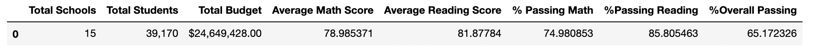
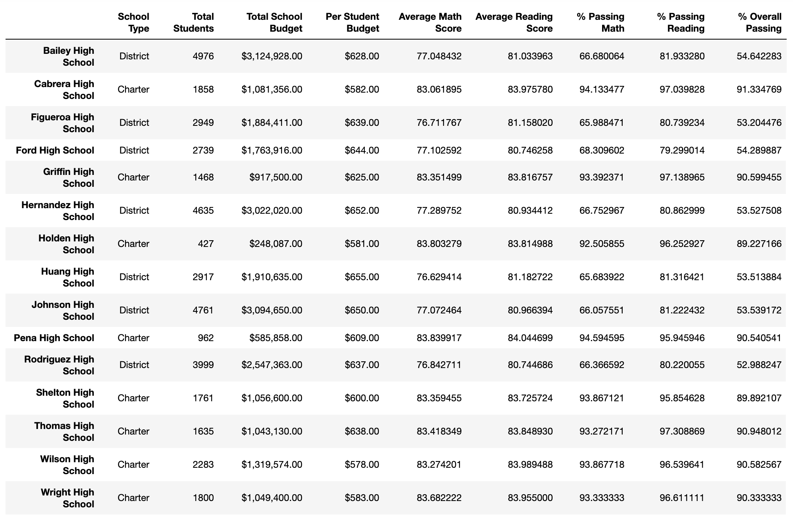
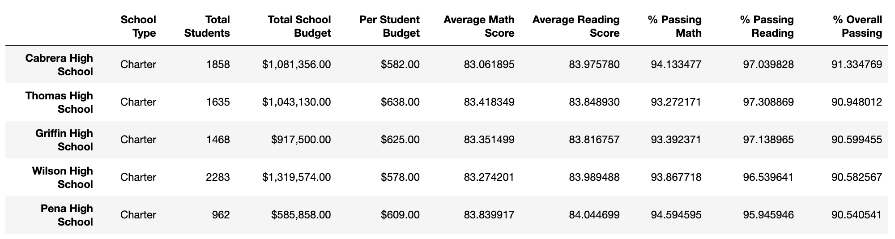
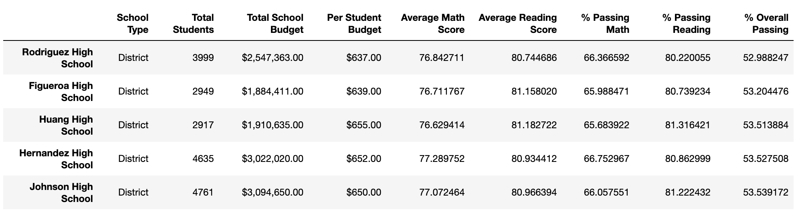

# Pandas Challenge
In this challenge pandas is explored to further analyze school data.

## Written Analysis

On the District Summary table, it is shown that on the Overall Passing column over half of the student body is passing both math and reading. If we view the other tables that analyzes each of the schools, we can see that the information is broken down further. 

### District Summary Table

When we move to observe the School Summary table, the data is now organized by the fifteen different schools. When comparing the School Type column along with the Total Students it can be observed that District type schools had a larger number of students when compared the Charter type schools. This also goes along with the Total School Budget column. Since District type schools had more students compared to Charter type schools it would make sense that the budget size would be larger since they contained a larger number of students.

### School Summary Table

Two more tables were formed to present the top and bottom performing schools. In the Top Performing Schools table, we see that the top five schools listed are all charter schools that are passing with a high percentage. When compared to the Bottom Performing Schools table, all five schools that are listed are from District School types and from comparing these two tables it can be observed that Charter schools outperformed District schools. 

### Top Performing Schools

### Bottom Performing Schools

